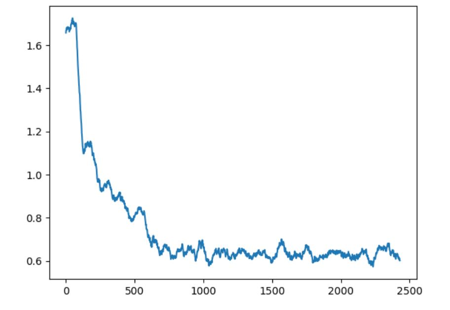
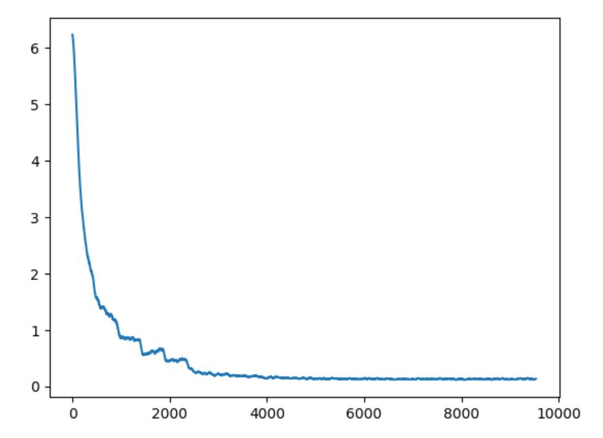
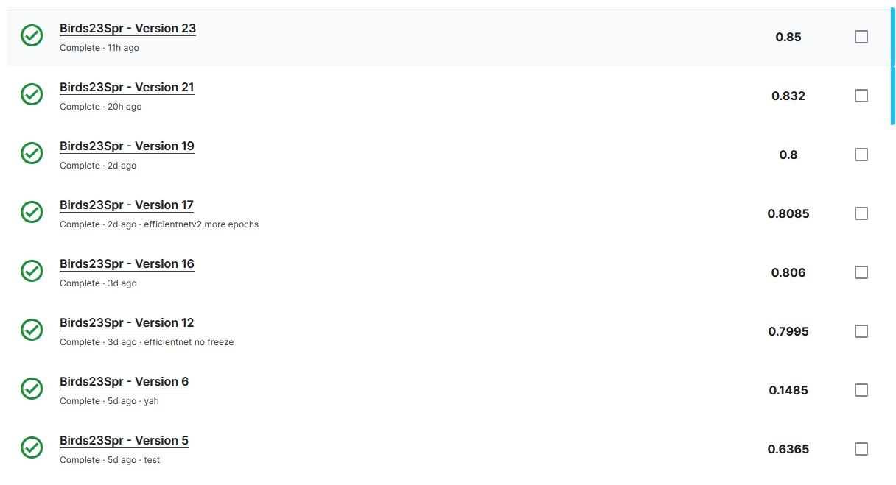

# Finalprojbirds

## Note:
This project was just the default kaggle bird species classification one. Everything was done on kaggle, I just downloaded the code over to github to basically use the readme for the 'website'. I was thinking of having the website summary requirements written in the kaggle notebook itself and share that, but I'm not sure if its possible to share the notebook by link and not have it be shared to everyone, so github it is.

## What I Used (Pre-existing work)
- Pytorch
- Split-folders for new modified dataset
- Predict method from the tutorial on cse 455 website to evaluate on test set and create the actual csv submission file
- The get_bird_data (ImageFolder + DataLoader), though had to modify to split training into 80/20 sets

## Problem Setup
I first basically just used the example from the tutorial on the cse 455 website, transfer learning with birds. This was basically just me familiarizing myself with the pytorch syntax and using kaggle collab. Afterwards, I tried different models and techniques. I'm still kind of new to kaggle, and I wasn't able to find a way to run the model in the background without saving and making a new version (if it's even possible to not), so my notebook just has a lot of versions (23 - most failed to some some error). Here's an basic timeline of what I did and an overview of the versions that worked* with their respective scores:

## Try 1 - Resnet18 (tutorial)
Basically just the "Transfer Learning to Birds" from website. I was trying to work out how the given dataset is formatted, what the other files (labels, names, sample) were and if they were relevant to training the model, etc.

Score - 0.6365

## Try 2 - Efficientnetb0
After looking around online about the various model architectures and how they performed on Imagenet, I decided to go with Efficientnet, freezing the earlier layers. I went with Efficientnetb0 which had the least parameters as a starting point. While this run succeeded, a mistake in my code ended up with predict using the untrained model for the actual evaluation instead of the trained one, so I got a terrible score.

Score - 0.1485

## Try 2.5 - Split dataset, new training method, brief attempt with tensorflow
I split the training set into training / valid sets using torch random-split (80/20), then changed the training method to include an evaluation on the valid sets. I also added a dropout layer to the classifier layer. This training was successful, but the run failed because I changed the 'losses' datatype into a 2d array to hold both the train and val losses, but forgot to update the plot.

At this point, I decided to make a new notebook to try out tensorflow instead of pytorch, because the provided functions just seemed cleaner and simpler. This basically failed and I gave up this approach, but I ended up with a new modified dataset that I created while working with this notebook (since keras had no built in random split).

## Try 3 - Efficientnet but actually works
While try 2.5 failed, the model still finished training and and I could see the accuracies in the log. It was pretty low, and I thought that I might've been underfitting the model, so I unfreezed the earlier layers and removed the dropout layer. I also increased the number of epochs to 20 (from 10), and this time the model performed much better.

Score - 0.7995

## Try 4 - New Model, DataLoader Shenanigans
I decided to try efficientnetv2-s in hopes of increasing accuracy. It's at this point that I realized using random_split on the dataset from ImageFolder meant I was basically splitting the dataset after the augmentations, which meant my valid set was being augmented too. I decided to use the modified dataset, but ran into a runtime error of trying to resize an unresizable storage. I thought something was wrong with the modified dataset, so went back to using the given one and just applied the transformations after the split using a wrapper class, but that failed too. It turned out that I tried to cut corners and just use the transform_test for my valid set to since it had no other augmentations, but the resize there didnt create a 224x224 image for my valid set.

Score - 0.806

## Try 5 - More epochs
I switched epochs back to 10 earlier when trying efficientnetv2, increased to 20 again.

Score - 0.8085

## Try 6 - Overfitting issues, tuning model
Added more augmentations, including vertical flip, color jittering and rotations. I added back in the dropout layer, but all this ended up decreasing performance.

Score - 0.8

## Try 7 - Removing some augmentations, SGD optimizer
I removed the random rotation augmentations, because it was leaving blank areas that I worried may impact training. I randomly clicked through some of the images in the set and noticed none were truly upsidedown (sometimes angled, but not upsidedown). So I lowered the probability of the vertical flip. I switched to an sgd optimizer instead of adam and set momentum to 0.9 to account for the dropout layer.

Score - 0.832

## Try 8 - Modified Dataset
As I was typing this up, I realized that the pytorch random-split isn't stratified, so it wouldn't have equal proportions of the classes in the split datasets. This means some species might be over / under-represented. So I went back and used the modified dataset that I had created earlier instead (with code in the try2-keras-splitdataset). 

Score - 0.85

## Next Steps
I'd like to adjust the parameters some more, try out different optimizers and loss functions. The biggest issue was that because each run takes so long (4-7 hours even on GPU), I always make multiple changes (new augmentations, add regularisation, change learning weight, etc.) per run, so hard to tell what exactly might be detrimental or helpful.

## Demo(?)
The training process takes way too long, but all the results (accuracies + losses for each epoch, graphs) should be on the birds23spr.ipynb. Here's the graphs from there:

Val loss

Train loss

Submissions history

